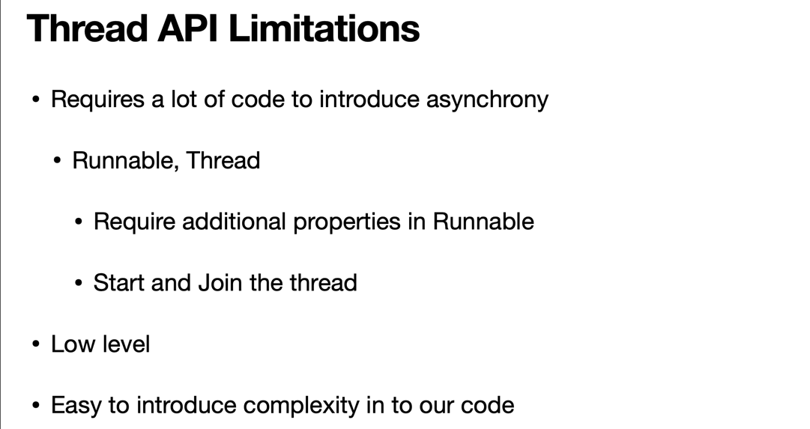
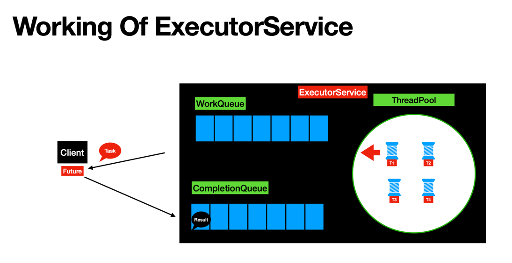

# Difference between Concurrency and Parallelism

# Using thread 
1. In `ProductServiceUsingThread`, we reduce the executing time by almost half. The limitations of thread api

# Using ExecutorService (an improvement of thread)
1. ExecutorService in Java is an Asynchronous Task Execution Engine
2. The working process of ExecutorService 

# Q & A
1. Callable and Runnable?
2. 

