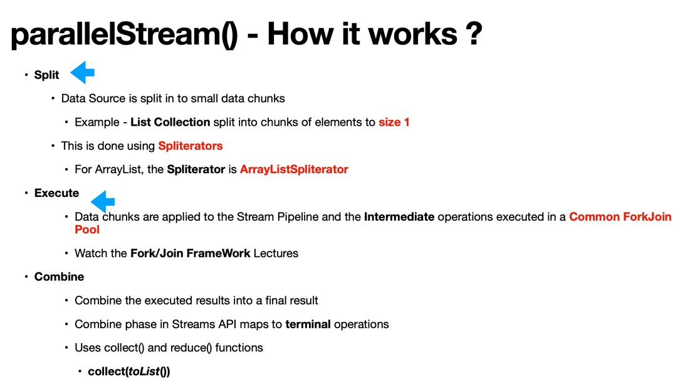
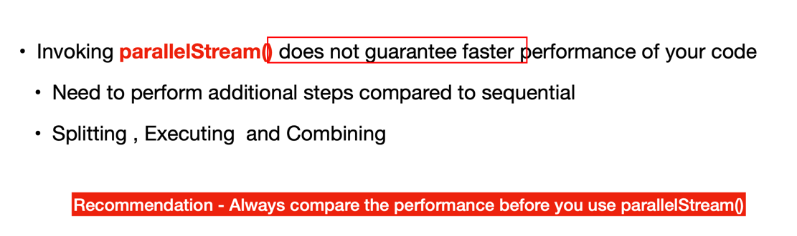
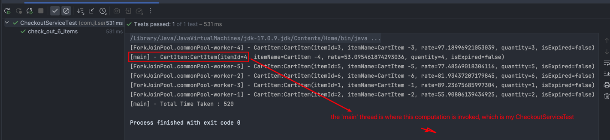
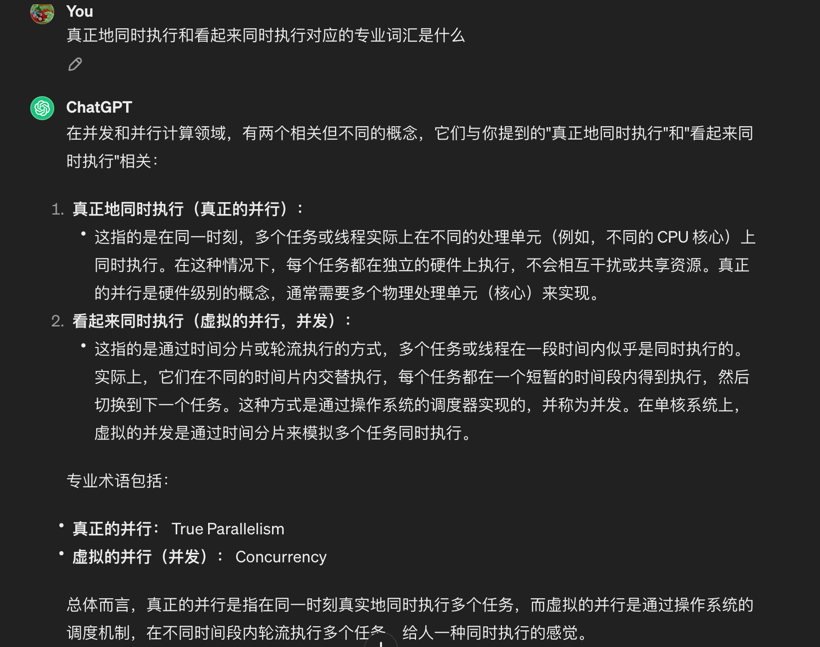
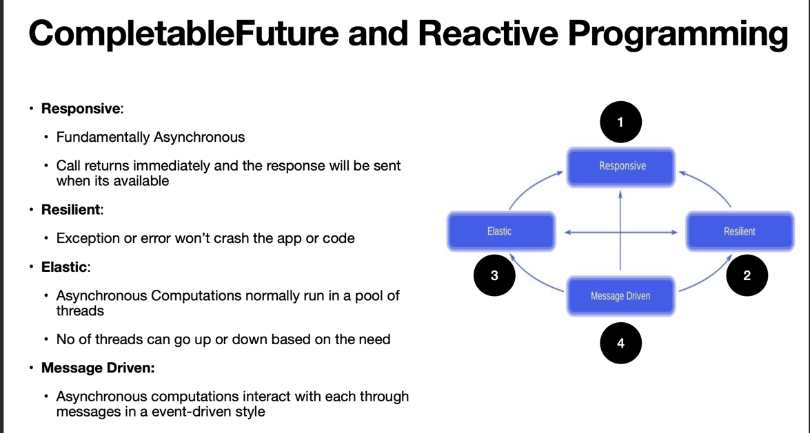

# Concurrency VS Parallelism

# Using thread 

## Runnable and Thread in Java
1. In `ProductServiceUsingThread`, we reduce the executing time by almost half. The limitations of thread api

## Using ExecutorService (an improvement of thread)
1. ExecutorService in Java is an Asynchronous Task Execution Engine
2. The working process of ExecutorService 

##  Fork/Join Framework
1. an extension of ExecutorService
2. Is designed to achieve **Data Parallelism** while ExecutorService is designed to achieve **Task Based Parallelism**.

# Streams API

## Mix use of sequential() and parallel()
 ``List<String> mappedNameList = names
 .parallelStream()
 .map(ComputeUtil::addNameLengthTransform)
 .sequential()
 .toList();``  will take around 2 seconds

``List<String> mappedNameList = names
.stream()
.map(ComputeUtil::addNameLengthTransform)
.parallel()
.toList();`` will take reduce the time by 1/4

## the performance of your tasks is closely related with your number of cores,
try execute `Runtime.getRuntime().availableProcessors()`
As I have 11 cores, so it will take the same time for 6 parallel tasks and 11 tasks, while it's also the same for 12 and 22 tasks executed parallely.

## How parallelStream works?

## Invoking parallelStream() **does not guarantee** faster performance of your code

## performance of collect() and reduce()
if you have boxing and unboxing in your parallelStream(), you will have a poor performance;

# Common ForkJoin Pool

1. Common ForkJoin Pool is an Execution Engine for Parallel Streams
2. Common ForkJoin Pool is used by:
   • ParallelStreams
   • CompletableFuture
   • Completable Future have options to use a User-defined ThreadPools
   • Common ForkJoin Pool is shared by the whole process
3. the nums of parallelism is equal to your nums of cores by default.
4. Modifying the nums of parallelism: `System.setProperty("java.util.concurrent.ForkJoinPool.common.parallelism", "100");`

## When to use ParallelStream()  and When not?
 1. Parallel Streams do a lot compared to sequential(default) Streams 
    1. Split 
    2. Execute 
    3. Combine
 2. When it comes to Computation takes a longer time to complete  / Lots of data / More cores in your machine, it's better to use ParallelStream()
 3. But sometimes, data types like LinkedList performance poorly as regarding Split, so not using ParallelStream()
 4. Others like
    1. Data set is small
    2. Auto Boxing and Unboxing don't perform better
    3. Stream API operators -> iterate(), limit()
 

# CompletableFuture

* Introduced in Java 8 
* CompletableFuture is **an Asynchronous Reactive Functional Programming API**
* Asynchronous Computations in a functional Style 
* CompletableFutures API is created to solve the limitations of Future API 
* supplyAsync() / thenApply() / thenAccept()
* thenCombine() / thenCompose()

# Q & A
1. Callable and Runnable?
2. Data Parallelism and Task Based Parallelism

